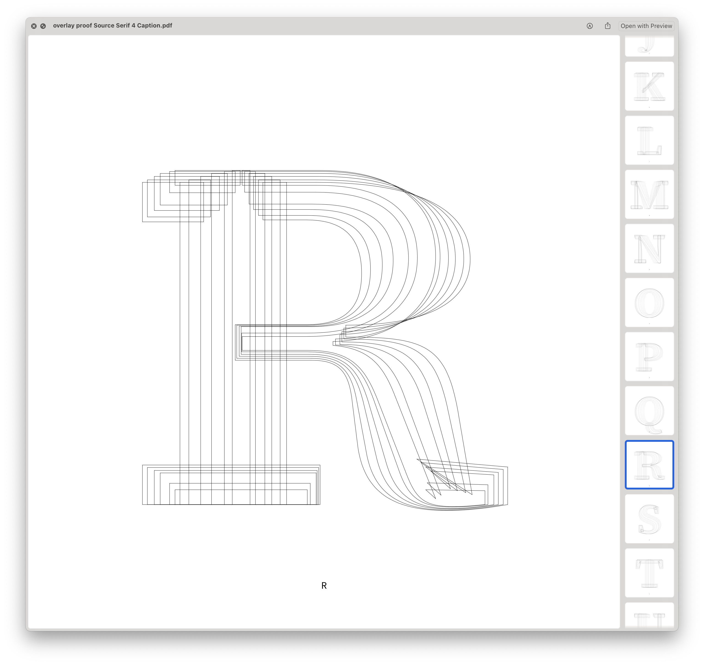
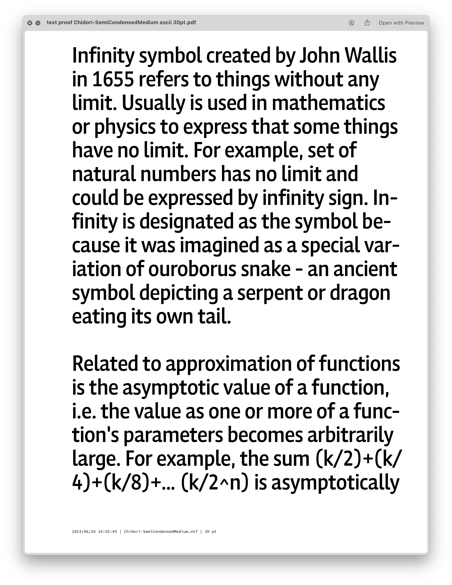
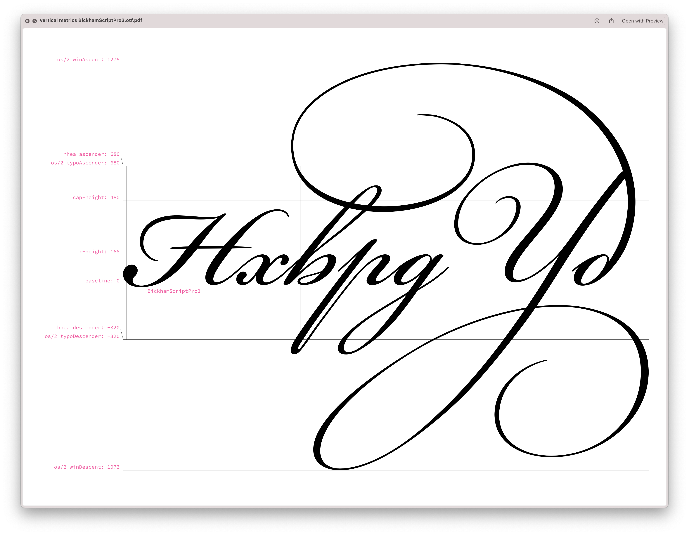
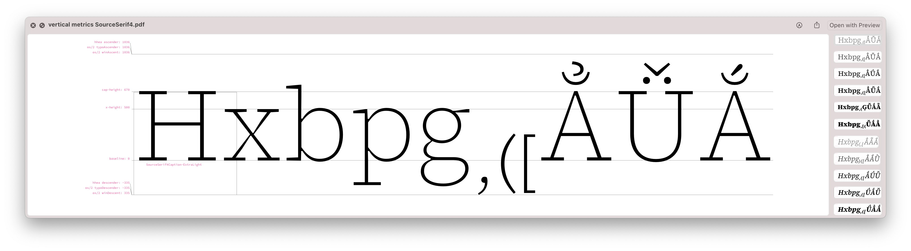

# DrawBot scripts for proofing fonts and/or UFOs.

## Prerequisites

- we recommend using a Python virtual environment. You can easily create
and activate one with the following commands in Terminal:

```bash
python3 -m venv my_venv
source my_venv/bin/activate
```

- once you have a virtual environment activated, the proofing tools themselves
can be installed via `pip`:

```bash
pip install git+https://github.com/adobe-type-tools/drawBotProofing.git
```
Further installation instructions can be found in [INSTALLATION.md](INSTALLATION.md).

You’re now ready to start proofing!

----


### `accent-proof`

Proof of all Latin accents supported by a given font, with example words for
each accent (both upper- and lowercase). Additionally, words with “atomic”
Latin base glyphs (such as æðøß) will be shown.

Input:
* font file(s), or folder(s) containing font files


----

### `alphabet-proof`

Creates example pages for:

- general alphabet (upper- and lowercase)
- spacing proofs
- some sample words

Modes (`proof`, `spacing`, `sample`) can be chosen individually, or all at once
(`all`).

Writing systems supported are `lat`, `grk`, `cyr`, and `figures`. By default,
supported writing systems are automatically chosen on a per-font basis.

Kerning can be toggled off (`-k`).

Optionally, a sample string (`-s`), or an input text file file (`-t`) can be
specified. When using an input a text file, there will be no reflow (which may
mean that lines exceed the right edge of the page). A double-line break in the
text file translates to a new page in the proof.

Input:
* font file(s), or folder(s) containing font files


----

### `charset-proof`

Visualizes a given (Adobe) character set.
The default charset is AL-3. Code points not supported in the font at hand will
be shown as a .notdef glyph (but are still present as text in the PDF file).

More information on Adobe’s character sets:

- [Latin](https://github.com/adobe-type-tools/adobe-latin-charsets)
- [Cyrillic](https://github.com/adobe-type-tools/adobe-cyrillic-charsets)
- [Greek](https://github.com/adobe-type-tools/adobe-greek-charsets)

Input:
* font file(s), or folder(s) containing font files


----

### `context-proof`

Creates example pages for usage of a specific letter or letter combination.

Needs a word list as an input file, such as the word lists available at
https://github.com/hermitdave/FrequencyWords/tree/master/content/2016

Input:
* font file(s), or folder(s) containing font files


----

### `figure-spacing-proof`

Simple script to check figure spacing in fonts or UFOs (without kerning).
For each figure suffix found (such as .tosf), a new spacing page is made.

Input (pick one):
* folder(s) containing UFO- or font files
* individual UFO- or font files
* designspace file (for proofing UFO sources)


----

### `glyph-proof`

Creates a PDF document which helps comparing glyphs to each other.
Various modes are possible – the default is an
[Autopsy](https://vimeo.com/116063612)-like showing of glyphs in a grid view.
Other modes include
* `gradient` (horizontal waterfall)
* `single` (page-by-page)
* `overlay` (superimposed outline view)

Input (pick one):
* folder(s) containing UFO- or font files
* individual UFO- or font files
* designspace file (for proofing UFO sources)

In the input filtering process, UFO files are preferred to fonts, OTFs to TTFs.
If results are unexpected, it helps to specify input files one-by-one.





----

### `glyphset-proof`

Visualizes the complete glyphset of a font or UFO on a single page.
The output is good to use with a diffing tool like `diff-pdf` in a later step.

The glyphset can be filtered with a regular expression (for example,
use `-r ".*dieresis"` to show all glyphs whose names end with -dieresis).

Input (pick one):
* folder(s) containing UFO- or font files
* individual UFO- or font files
* designspace file (for proofing UFO sources)


----

### `overlay-proof`

Proofing tool for overlaying releated fonts on top of each other.
Some smartness is used to make sure fonts end up on the same baseline.

To-Do:
- make font pairing smarter
- allow overlaying static and VF

Input (pick one):
* folder(s) containing font files
* individual font files


----

### `reference-proof`

Create samples for a string of characters, set in all fonts that support it.
The choice of fonts is either all installed fonts (no argument), or all fonts
in a given folder tree. The font list can be filtered by supplying a regular
expression.

This proof helps solving the question
“How do other fonts deal with this weird glyph?”

Input:
1. sample characters
2. folder containing font files
   (or no argument, which means parsing all installed fonts)


----

### `text-proof`

Create example paragraphs corresponding to a given character set.

Default mode is creating single-page PDF with a random subset of the requested
charset. Optionally, a full charset can be consumed systematically, to show
as many characters as possible.
The alternative mode is using a text file as input, to achieve more predictable
(and comparable) output. In text-mode, the output is limited to a single
page (no matter how long the text file may be).

Known bug:
Line spacing may become inconsistent if a character set beyond the font’s
character support is requested (this is a macOS limitation caused by the
vertical metrics in a given fallback font).

Input:
* font file(s), or folder(s) containing font files

Optional input:
* choice of text file (`-t`) or charset name (`-c`)
* secondary font(s) (`-s`) (for mixing Roman/Italic, for example)





----

### `unicode-chart-proof`

Creates character charts similar to those appearing in The Unicode® Standard,
but using the supplied font (and only the characters present in the font).

Input: font file or folder containing font files

CLI Inputs: see help


----

### `vertical-metrics-comparison-proof`

Creates pages with example characters to visualize the variation
of vertical metrics across a typeface family.

Input (pick one):
* folder(s) containing UFO files or font files
* individual UFO- or font files
* designspace file (for proofing UFO sources)


----

### `vertical-metrics-proof`

Creates simple view which illustrates all vertical metrics
set in the font metadata. Additionally, tallest and lowest glyphs are shown.

Using the -e option, the number of reported extreme glyphs can be modified.

Input:
* font file(s), or folder(s) containing font files






----

### `waterfall-proof`

Creates pages of example words for a list of fonts, arranged in waterfall-like
fashion (both vertically and horizontally).

The proof text comes from the waterfall_horizontal and waterfall_vertical text
files found in the `_content` folder.

Input:
* folder containing font files


----


## Acknowledgements

- "en_10k.txt" is based on [en_50k.txt](https://github.com/hermitdave/FrequencyWords/blob/525f9b560de45753a5ea01069454e72e9aa541c6/content/2016/en/en_50k.txt) from the [FrequencyWords](https://github.com/hermitdave/FrequencyWords) project, Copyright (c) 2016 Hermit Dave
- fonts included in this distribution are subject to the SIL Open Font License, Copyright 2016-2023 Adobe.
- Unicode and the Unicode Logo are registered trademarks of Unicode, Inc. in the United States and other countries.

