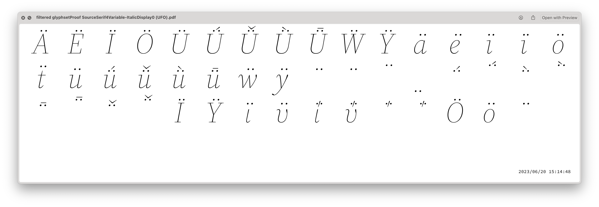

# DrawBot scripts for proofing fonts and/or UFOs.

## Prerequisites

- we recommend using a Python virtual environment. You can easily create and activate one with the
following commands in Terminal:
```
python3 -m venv my_venv
source my_venv/bin/activate
```

- once you have a virtual environment activated, install `drawBot` and script dependencies by running
the following command from the same directory where this file resides:
```
python -m pip install -r requirements.txt
```

You're now ready to run the scripts!

----


### `accentProof.py`

Proof of all accents with a representation of all glyphs using that accent,
and example words for each accent (both upper- and lowercase).
Additionally, words with “merged” non-abc glyphs (such as æðøß) will be shown.

This script is currently limited to AL-3, an extension to AL-4 and beyond is
thinkable.

Input: single font or folder containing font files.


----

### `alphabetProof.py`

Creates example pages for:

- general alphabet (upper- and lowercase)
- spacing proofs
- some sample words

Modes (`proof`, `spacing`, `sample`) can be chosen individually, or all at once
(`all`). Writing systems supported are `lat`, `grk`, `cyr`, and `figures`.

Input: one or more font files.


----

### `charsetProof.py`

Visualizes a given (Adobe) character set.
The default charset is AL-3. Code points not supported in the font at hand will
be shown as a .notdef glyph (but are still present as text in the PDF file).

More information on Adobe’s character sets:

- [Latin](https://github.com/adobe-type-tools/adobe-latin-charsets)
- [Cyrillic](https://github.com/adobe-type-tools/adobe-cyrillic-charsets)
- [Greek](https://github.com/adobe-type-tools/adobe-greek-charsets)

Input: font file(s) or folder of fonts.


----

### `glyphsetProof.py`

Visualizes the complete glyphset of a font or UFO on a single page.
The output is good to use with a diffing tool like `diff-pdf` in a later step.

The glyphset can be filtered with a regular expression (for example,
use `-r ".*dieresis"` to show all glyphs whose names end with -dieresis).

Input: folder containing UFO or font files, individual fonts or UFOs.




----

### `makeReadme.py`

Create/update the README.md file for this repository.

    python3 makeReadme.py

----

### `textProof.py`

Creates example paragraphs corresponding to a given character set.
Either prints a single page with random subset of the charset, or consumes
the full charset systematically, to create a multipage document.

Known bug:
line spacing may become inconsistent (this is a macOS limitation caused by
the vertical metrics in a given fallback font.)

Input: folder containing fonts, or single font file.


----


## Acknowledgements

- "en_10k.txt" is based on [en_50k.txt](https://github.com/hermitdave/FrequencyWords/blob/525f9b560de45753a5ea01069454e72e9aa541c6/content/2016/en/en_50k.txt) from the [FrequencyWords](https://github.com/hermitdave/FrequencyWords) project, Copyright (c) 2016 Hermit Dave
- fonts included in this distribution are subject to the SIL Open Font License, Copyright 2016-2023 Adobe.

